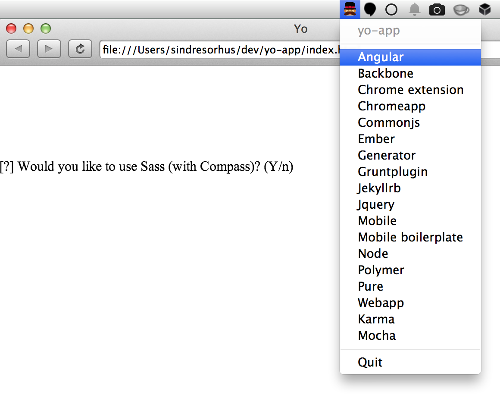

# yo-app

> Experimental [yo](https://github.com/yeoman/yo) app *(OS X)*

## Dev

### Setup

- Download [node-webkit](https://github.com/rogerwang/node-webkit#downloads) and put it in `/Applications`
- Add `alias nw='/Applications/node-webkit.app/Contents/MacOS/node-webkit'` to your .bashrc/.zshrc

### Run

- `cd` into the app folder
- Run `npm install` *(only first time)*
- Run `nw .`

## License

MIT © [Sindre Sorhus](http://sindresorhus.com)
